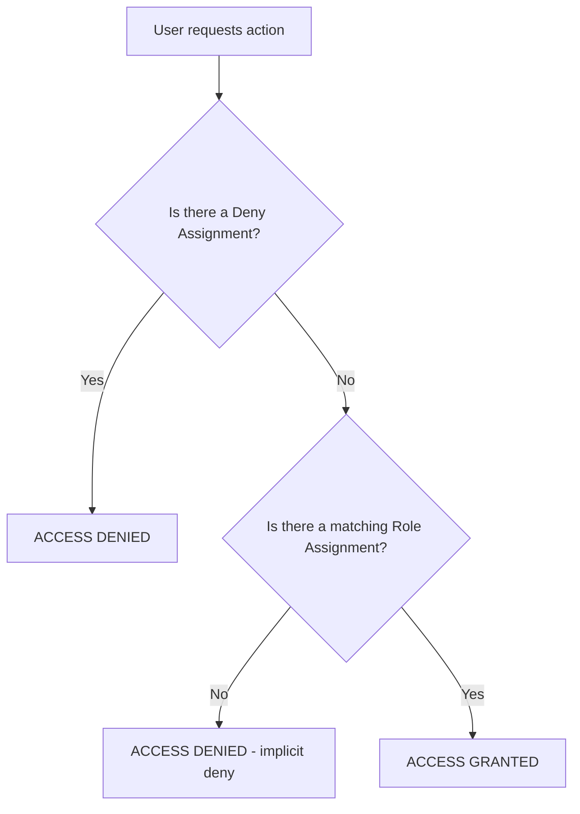

# 1.2 Manage Role-Based Access Control (RBAC) — AZ-104 Study Notes

---

## Overview

**Role-Based Access Control (RBAC)** is the authorization system in Azure that helps you manage:
- **Who** has access to Azure resources (security principal)
- **What** they can do with those resources (role definition)
- **Where** they have access (scope)

> [!IMPORTANT]
> Azure RBAC is about **Azure resource** authorization. It is different from **Azure AD roles** which manage Azure AD directory operations.

---

## Core RBAC Concepts

### The Three Pillars of RBAC

```
Role Assignment = Security Principal + Role Definition + Scope
```

### 1. Security Principal (WHO)

| Type | Description |
|------|-------------|
| **User** | An individual in Azure AD |
| **Group** | A set of users; role applied to all members |
| **Service Principal** | Identity for an application or service |
| **Managed Identity** | Azure-managed identity for services (system or user-assigned) |

### 2. Role Definition (WHAT)

A collection of permissions. Each role definition lists the **Actions** (allowed) and **NotActions** (excluded):

```json
{
  "Name": "Custom Role Name",
  "Description": "Can read and restart VMs",
  "Actions": [
    "Microsoft.Compute/virtualMachines/read",
    "Microsoft.Compute/virtualMachines/restart/action"
  ],
  "NotActions": [],
  "DataActions": [],
  "NotDataActions": [],
  "AssignableScopes": ["/subscriptions/{sub-id}"]
}
```

| Property | Description |
|----------|-------------|
| **Actions** | Control plane operations allowed |
| **NotActions** | Control plane operations excluded from Actions |
| **DataActions** | Data plane operations allowed |
| **NotDataActions** | Data plane operations excluded |
| **AssignableScopes** | Scopes where role can be assigned |

> [!NOTE]
> **Effective permissions** = Actions - NotActions. NotActions is NOT a deny rule — it simply subtracts from Actions.

### 3. Scope (WHERE)

Scope is hierarchical — permissions **inherit downward**:

```
Management Group
  └── Subscription
        └── Resource Group
              └── Resource
```

Scope format:
- Management group: `/providers/Microsoft.Management/managementGroups/{mg-id}`
- Subscription: `/subscriptions/{sub-id}`
- Resource group: `/subscriptions/{sub-id}/resourceGroups/{rg-name}`
- Resource: `/subscriptions/{sub-id}/resourceGroups/{rg-name}/providers/{provider}/{resource}`

---

## Four Fundamental Built-in Roles

| Role | Description | Scope |
|------|-------------|-------|
| **Owner** | Full access + can delegate access to others | All resource types |
| **Contributor** | Full access except cannot manage role assignments | All resource types |
| **Reader** | View all resources but no changes | All resource types |
| **User Access Administrator** | Manage user access to Azure resources | All resource types |

### Other Important Built-in Roles

| Role | Key Permissions |
|------|----------------|
| **Virtual Machine Contributor** | Manage VMs but not VNet/storage they connect to |
| **Network Contributor** | Manage networking resources |
| **Storage Account Contributor** | Manage storage accounts (not access to data) |
| **Storage Blob Data Reader** | Read blob data (data plane) |
| **Storage Blob Data Contributor** | Read/write/delete blob data |
| **Storage Blob Data Owner** | Full blob access including RBAC |
| **Security Admin** | View/update security policies, view alerts |
| **Backup Contributor** | Manage backup except vault creation |
| **Cost Management Reader** | View cost data and configuration |

> [!TIP]
> Know the difference: **Storage Account Contributor** manages the account (control plane) but **cannot access the data**. You need **Storage Blob Data \*** roles for data plane access.

---

## 1.2.1 Create a Custom Role

### When to Create Custom Roles?
- When **built-in roles** don't meet your organization's needs
- Requires **Azure AD Premium P1** or **P2** (or pay-as-you-go)

### Custom Role Limits
- **5,000** custom roles per tenant
- Can be scoped to **management groups, subscriptions, or resource groups**

### Creating via Portal
Azure portal → Subscriptions → Access control (IAM) → Add → Add custom role

Steps:
1. **Basics**: Name, description, baseline (start from scratch / clone / JSON)
2. **Permissions**: Add or remove actions and data actions
3. **Assignable scopes**: Define where this role can be assigned
4. **JSON**: Review and edit raw JSON
5. **Review + create**

### Creating via PowerShell
```powershell
# Method 1: From JSON file
New-AzRoleDefinition -InputFile "C:\CustomRole.json"

# Method 2: Using PSRoleDefinition object
$role = Get-AzRoleDefinition "Virtual Machine Contributor"
$role.Id = $null
$role.Name = "VM Operator"
$role.Description = "Can start, stop, and restart VMs"
$role.Actions.Clear()
$role.Actions.Add("Microsoft.Compute/virtualMachines/start/action")
$role.Actions.Add("Microsoft.Compute/virtualMachines/restart/action")
$role.Actions.Add("Microsoft.Compute/virtualMachines/deallocate/action")
$role.Actions.Add("Microsoft.Compute/virtualMachines/read")
$role.AssignableScopes.Clear()
$role.AssignableScopes.Add("/subscriptions/{sub-id}")
New-AzRoleDefinition -Role $role
```

### Creating via Azure CLI
```bash
# From JSON file
az role definition create --role-definition CustomRole.json

# JSON example
{
  "Name": "VM Operator",
  "Description": "Can start, stop, and restart virtual machines",
  "Actions": [
    "Microsoft.Compute/virtualMachines/start/action",
    "Microsoft.Compute/virtualMachines/restart/action",
    "Microsoft.Compute/virtualMachines/deallocate/action",
    "Microsoft.Compute/virtualMachines/read"
  ],
  "NotActions": [],
  "AssignableScopes": ["/subscriptions/{sub-id}"]
}
```

### Updating a Custom Role
```powershell
# PowerShell
$role = Get-AzRoleDefinition "VM Operator"
$role.Actions.Add("Microsoft.Compute/virtualMachines/powerOff/action")
Set-AzRoleDefinition -Role $role

# CLI
az role definition update --role-definition UpdatedRole.json
```

### Deleting a Custom Role
```powershell
# PowerShell
Remove-AzRoleDefinition -Name "VM Operator"

# CLI
az role definition delete --name "VM Operator"
```

> [!WARNING]
> You must **remove all role assignments** that use the custom role before you can delete it.

---

## 1.2.2 Assign Roles at Different Scopes

### How to Assign Roles — Portal
1. Navigate to the **scope** (Management group / Subscription / Resource group / Resource)
2. Click **Access control (IAM)**
3. Click **Add** → **Add role assignment**
4. Select **Role** → Select **Members** → Select **Scope** → **Review + assign**

### How to Assign Roles — PowerShell
```powershell
# Assign at subscription scope
New-AzRoleAssignment -SignInName "user@contoso.com" `
  -RoleDefinitionName "Contributor" `
  -Scope "/subscriptions/{sub-id}"

# Assign at resource group scope
New-AzRoleAssignment -SignInName "user@contoso.com" `
  -RoleDefinitionName "Reader" `
  -ResourceGroupName "myRG"

# Assign to a group
New-AzRoleAssignment -ObjectId "<group-object-id>" `
  -RoleDefinitionName "Virtual Machine Contributor" `
  -ResourceGroupName "myRG"

# Assign at resource scope
New-AzRoleAssignment -SignInName "user@contoso.com" `
  -RoleDefinitionName "Storage Blob Data Reader" `
  -Scope "/subscriptions/{sub-id}/resourceGroups/myRG/providers/Microsoft.Storage/storageAccounts/mystorageacct"
```

### How to Assign Roles — CLI
```bash
az role assignment create \
  --assignee "user@contoso.com" \
  --role "Contributor" \
  --scope "/subscriptions/{sub-id}"
```

### Scope Inheritance Rules
- Permissions assigned at a **parent scope** are inherited by **child scopes**
- Example: Contributor at subscription level → automatically Contributor on all RGs and resources in that subscription
- **Most restrictive scope** → best security practice (principle of least privilege)

### Classic Subscription Administrator Roles

| Role | Description |
|------|-------------|
| **Account Administrator** | Billing owner; manages subscriptions (1 per Azure account) |
| **Service Administrator** | Full access to manage resources (1 per subscription) |
| **Co-Administrator** | Same as Service Admin but cannot change the Service Admin |

> [!NOTE]
> Classic roles are legacy. Use **Azure RBAC** for new deployments. Classic roles are still supported for backward compatibility.

### Elevate Access (Global Admin)
- A **Global Administrator** in Azure AD can **elevate** themselves to **User Access Administrator** at root scope
- Portal: Azure AD → Properties → Access management for Azure resources → Yes
- This is useful when you lose access to subscriptions
- **Remove elevated access** when no longer needed

---

## 1.2.3 Interpret Access Assignments

### Viewing Role Assignments — Portal
Resource/RG/Subscription → Access control (IAM) → Role assignments

Shows:
- **Who** — User, group, or service principal
- **Role** — The assigned role
- **Scope** — Where it applies
- **Inheritance** — Whether inherited from parent scope

### Check Access (Portal)
Access control (IAM) → **Check access** → Enter user/group → View effective permissions

### Viewing via PowerShell
```powershell
# List all role assignments at a scope
Get-AzRoleAssignment -Scope "/subscriptions/{sub-id}"

# Check specific user
Get-AzRoleAssignment -SignInName "user@contoso.com"

# Filter by resource group
Get-AzRoleAssignment -ResourceGroupName "myRG"
```

### Viewing via CLI
```bash
az role assignment list --scope "/subscriptions/{sub-id}"
az role assignment list --assignee "user@contoso.com"
```

### Understanding Permission Calculation

**Effective permissions** are calculated as:
1. Start with role's **Actions**
2. Subtract **NotActions** → = allowed operations
3. Add **DataActions** and subtract **NotDataActions** → = allowed data operations
4. If any **Deny Assignment** exists → it **overrides** all allows

### Azure Deny Assignments

| Feature | Description |
|---------|-------------|
| **Purpose** | Block users from performing specific actions even if a role grants access |
| **Created by** | Azure Blueprints and Azure managed apps (not directly by users) |
| **Scope** | Can be set at any scope |
| **Override** | Deny assignments **take precedence** over role assignments |

> [!IMPORTANT]
> You **cannot create deny assignments directly**. They are only created by Azure Blueprints and managed applications. However, you need to understand how they work for the exam.

### How Access is Evaluated



**Key rules:**
1. **Deny assignments** are checked first and always win
2. RBAC is an **additive model** — all granted permissions are added together
3. If no role assignment grants access → **implicit deny** (default deny)
4. **Owner** and **User Access Administrator** → cannot be blocked by deny assignments at the same scope

---

## Azure RBAC vs. Azure AD Roles

| Feature | Azure RBAC | Azure AD Roles |
|---------|-----------|---------------|
| **Purpose** | Manage Azure resource access | Manage Azure AD directory access |
| **Scope** | Management group, subscription, RG, resource | Tenant level |
| **Examples** | Owner, Contributor, Reader, VM Contributor | Global Admin, User Admin, Billing Admin |
| **Where assigned** | Portal → Access control (IAM) | Portal → Azure AD → Roles and administrators |
| **Custom roles** | Yes (PowerShell, CLI, REST, Portal) | Yes (Azure AD Premium P1) |

---

## Exam Tips — Section 1.2

- **Role assignment = Principal + Role + Scope** — memorize this formula
- Know the **4 fundamental roles**: Owner, Contributor, Reader, User Access Administrator
- **Owner vs. Contributor**: Owner can assign roles, Contributor cannot
- **NotActions ≠ Deny** — it simply subtracts from Actions
- **Deny assignments** override everything and are created only by Blueprints/managed apps
- **Scope inheritance**: Parent scope permissions flow down to children
- Custom role limit: **5,000 per tenant**
- **Data plane vs. Control plane**: Storage Account Contributor ≠ data access
- **Elevate access**: Global Admin → User Access Administrator at root scope
- Classic admin roles are legacy but know: Account Admin, Service Admin, Co-Admin
- **Principle of least privilege** — assign roles at the narrowest scope needed
